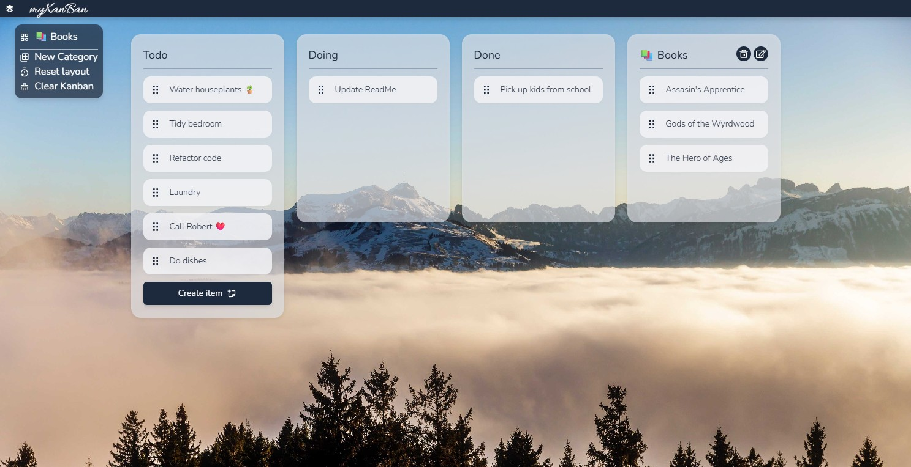

# Kanban

WIP School assignment using React/TS/Tailwind/Vite! Stay tuned for routing, useReducer, Context API and other awesomeness

A Kanban board built with React, TypeScript and Tailwind, using Vite. This project was made as a school assignment in my second semester of web development!

 

## Features
- Multiple columns - three base categories (todo, doing & done) and unlimited optional ones! 
- Add, edit and delete columns
- Add items (tasks) inside any column
- Drag and drop support for moving items between columns
- Persistent storage via LocalStorage; the board is saved automatically
- Nav with options for resetting the layout and to delete the entire contents of the board
- Deep linking to specific columns or items using URL params
- Responsive layout; centered columns on desktop and wrapped on mobile

## Tech
- **Frontend:** React, TypeScript, Tailwind
- **Libaries:**
  -  React Router: For routing. Putting search params to good use with conditional layouting.
  -  React icons: For icons in the project.
  -  Dnd kit: Making the items draggable and the columns droppable!
  -  UUID - Provides unique ID's and keys for custom columns and kanban-items! 
- **Build tool:** Vite  
- **Deployment:** Vercel  

## Takeaways
-

# The assignment - translated from Swedish, for your convenience:
> # About the Assignment
> 
> In this task, you are going to build a Kanban board app where the user can plan their to-dos or projects. The project is primarily about learning to build an application with React, which means that the code structure is important, while the number of features is relatively small in the project itself. If you have time and want an extra challenge, however, there are several suggestions for what you can add to the app.
> 
> # Case
> 
> # What You Should Do
> 
> **General Requirements**
> 
> - [ ] The task must be built with React  
> - [ ] The task must implement libraries from the React ecosystem  
> - [ ] The task must use some state management with Context  
> 
> ---
> 
> **Functionality**
> 
> The following functionality must be included:
> 
> 1. The user must be able to create new tasks, which are then placed as “cards” on the board.  
> 2. The user must be able to move the cards between the columns. Either by drag-and-drop or, for example, using a button to move left or right.  
> 3. It must be possible to click on a card to display more details about it. In this popup, the user should also be able to edit and delete the card.  
> 
> It must be possible to view only a single column. That is, click into a column and see only the cards in that column. This page must have its own URL so it can, for example, be bookmarked.  
> 
> ---
> 
> **For VG (higher grade)**
> 
> If you aim for VG, the individual cards shown under point 3 of the assignment must each have their own URL, which can be navigated to so that a user can, for example, bookmark such a page and go directly to it.
> 
> In addition to this, the VG level will be assessed based on the code quality of your routing and your application as a whole. This is in accordance with the course goals.
> 
> In short, it’s about the implementation of React and React libraries being solid. You should have a good code structure and follow the “philosophy” of React, without major mistakes or flaws in your code.  
> 
> ---
> 
> **Extra Challenge**
> 
> If you feel you’ve completed all the basic requirements in time, here are extra challenges that are good for additional practice:
> 
> - The user should be able to rename columns and create new columns *(this used to be a main requirement but makes routing unnecessarily difficult at the G level)*.  
> - The user should be able to change the background image and color theme of the application.  
> - Tasks should be able to be hidden or deleted. A hidden task remains in an archive but is not visible on the board.  
> - The user should be able to create multiple different boards in the system, each with its own tasks. Each board should also have its own URL so it can, for example, be bookmarked.  
> - There should be support for multiple different users in the same board, and each task should be possible to assign to one or more users.  

